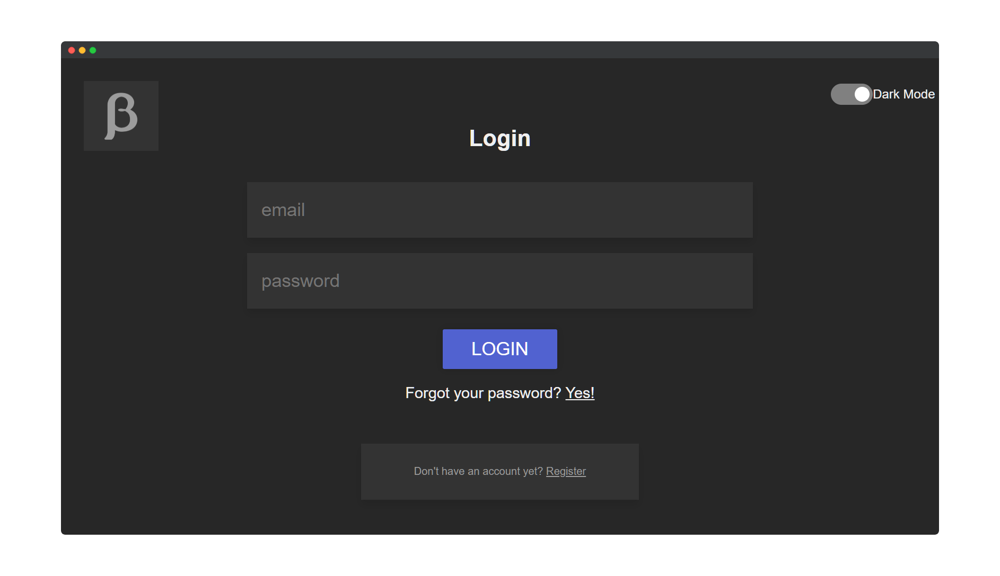

# Custom Node.js Authentication Server
> My custom Node.js Authentication Server for my other projects

## Introduction

This repo contains the source code for my Node.js Authentication Server. I use it for all my other projects when I need authentication (e.g. my [Temporary Email Service](https://github.com/BetaHuhn/betahuhn-forward) or [Sharing Service](https://share.betahuhn.de)).

The server is built with Node.js and uses JWT Tokens for authentication.

## Authentication flow
The server uses both a short lived access token to authenticate clients on a different app and long live refresh tokens with the auth server. 

### The authentication flow roughly looks like this:

**login request** -> create access_token and refresh_token (only RT is stored)

**authentication request to other app** -> check if access token is valid by using auth servers public key -> if not valid redirect client to auth server

**redirect from app to auth server** -> check if refresh token is still valid and matches unique client id -> generate new access token and redirect back to app

## Authors
* **Maximilian Schiller** ([@BetaHuhn](https://github.com/BetaHuhn)) - *Initial work*

## License

This project is licensed under the MIT License - see the [LICENSE.md](LICENSE.md) file for details
